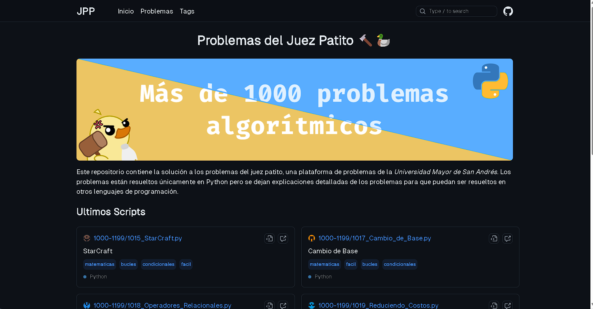
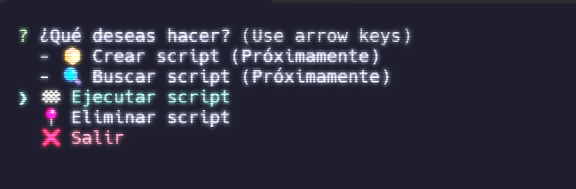

<h1 align="center">Problemas del Juez Patito 🔨🦆</h1>


<p align="center">
    <a href="https://www.python.org/">
        
    </a>
    <a href="https://jv.umsa.bo/oj/problemset.php">
        
    </a>
    <a href="https://repollodev.github.io/Problemas-del-Juez-Patito/">
        
    </a>
</p>

Este repositorio contiene la solución a los problemas del juez patito, una plataforma de problemas de la _Universidad Mayor de San Andrés_. Los problemas están resueltos únicamente en Python pero se dejan explicaciones detalladas de los problemas para que puedan ser resueltos en otros lenguajes de programación.

> [!IMPORTANT]
> Este repositorio únicamente es para guardar mis soluciones, no se recomienda copiar y pegar el código, **es mejor intentar resolver los problemas por ti mismo**.

> [!NOTE]
> No se encuentran todos los problemas de la plataforma, eventualmente se irán añadiendo más problemas conforme los vaya resolviendo o vayan saliendo nuevos problemas.

### 📚 Contenido

- [🎯 Objetivos](#-objetivos)
- [📁 Estructura del proyecto](#-estructura-del-proyecto)
- [📄 Formato de Scripts](#-formato-de-scripts)
- [📦 Extractor de datos](#-extractor-de-datos)
- [🌐 Página Web](#-página-web)
- [⌨️ CLI](#️-cli)

## 🎯 Objetivos

- [ ] Resolver 100 problemas
- [ ] Resolver 200 problemas
- [ ] Resolver 400 problemas
- [ ] Resolver 800 problemas
- [ ] Resolver 1200 problemas
- [ ] Resolver TODOS los problemas
- [x] Crear una base de datos con los problemas y soluciones
- [x] Crear un CLI para interactuar con el proyecto
- [x] Crear una página web estática para mostrar las soluciones

## 📁 Estructura del proyecto

El proyecto está enfocado en almacenar los scripts de Python con las soluciones a los problemas, se dividen en carpetas con rangos de problemas para poder tener un orden y una mejor organización.

Se tiene una carpeta `src` la cual contiene los funciones para interactuar con el proyecto, como la generación de la base de datos, la generación de la página web estática, entre otros.

```bash
# Carpetas con problemas separados por rangos
├── 1000-1199
│   ├── [id]_[Nombre del problema].py
│   ├── [id]_[Nombre del problema].py
│   ├── ...
├── 1200-1399
│   ├── [id]_[Nombre del problema].py
│   ├── [id]_[Nombre del problema].py
│   ├── ...
├── 1400-1599
│   ├── [id]_[Nombre del problema].py
│   ├── [id]_[Nombre del problema].py
├── ...
│
├── src
│   ├── cli # CLI para interactuar con el proyecto
│   ├── data # Funciones para generar la base de datos (JSON)
│   ├── web # Funciones para generar la página web estática
│   ├── ...
```

## 📄 Formato de Scripts

Los scripts de Python a parte de tener el código para resolver el problema, también contienen un formato de comentarios que se utiliza para generar la base de datos y la página web estática.

> [!NOTE]
> Los comentarios multilineas son contenido markdown potenciado con plugins de remark, por lo que no se verán correctamente en un editor de texto plano.

```python
# [id]
# [Nombre del problema]
# [Link del problema]
# tag1 tag2 tag3-con-espacios

"""description
El contenido de la descripción del problema
con imagenes o algun contexto necesario para
poder resolver el problema
"""

"""steps
En aquí se describe los pasos algoritmicos
que se sigue para poder resolver el problemas

1. leer datos en la variable `N`
2. hacer algo con `N`
3. ...
"""

print("Hola mundo")
```

## 📦 Extractor de datos

El proyecto posee varias funciones que en conjunto permiten extraer los datos de los scripts y generar una base de datos en formato JSON, esta base de datos se encuentra en la carpeta `src/data` y se puede generar con el siguiente comando:

```bash
# Para generar la base de datos
npm run data:build

# Para eliminar la base de datos
npm run data:delete

# Para reconstruir la base de datos
npm run data:rebuild
```

Todas estas funciones estan hechas con TypeScript para que sea posible utilizarlas en otras partes del proyecto.

## 🌐 Página Web

El proyecto tiene la capacidad de generar una página web estática con las soluciones a los problemas, utilizando [AstroJS](https://astro.build/) como generador de sitios estáticos.



El proyecto se encuentra en la carpeta `src/web` y se puede ejecutar con el siguiente comando:

```bash
# Para correr el proyecto en modo desarrollo
npm run dev

# Para construir el proyecto
npm run build
```

## ⌨️ CLI

El proyecto tiene un CLI para interactuar con el proyecto, se encuentra en la carpeta `src/cli`, el mismo tiene las siguientes opciones:

- **Crear Script**: Crea un nuevo script con el formato necesario
- **Buscar Script**: Busca un script por su nombre o id
- **Ejecutar Script**: Ejecuta un script por su nombre o id de forma interactiva
- **Eliminar Script**: Elimina un script por su nombre o id

Proximamente se añadirán más opciones al CLI.



Este CLI está construido con [InquirerJS](https://www.npmjs.com/package/inquirer) con algunos plugins para mejorar la experiencia de usuario. Se puede ejecutar con el siguiente comando:

```bash
# Para correr el CLI
npm run cli
```
